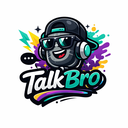

# TalkBro — Voice Companion Chrome Extension

> Speak naturally, get polished text. A floating side-by-side companion powered by **OpenAI Whisper** (local) & **open-source LLMs**.



## ✨ Features

- **🎤 One-tap voice recording** with real-time waveform visualization
- **🤖 OpenAI Whisper** running locally for accurate speech-to-text (no API key needed)
- **🧠 AI-powered text enhancement** via Ollama (local) or Groq (cloud)
- **📋 Instant copy** — copy raw transcript or enhanced text with one click
- **🎯 Enhancement presets** — Clean Up, Formal, Bullet Points, Email, Code Docs, Summary
- **🌗 Auto dark/light theme** following system preference
- **⌨️ Keyboard shortcuts** — `Alt+T` toggle panel, `Alt+R` start/stop recording
- **🔒 Privacy-first** — everything runs locally by default
- **📜 History** — searchable history of all transcriptions in the side panel

## 🚀 Quick Start

### Step 1: Install Python (if not already installed)
Download from [python.org](https://www.python.org/downloads/) — make sure to check "Add to PATH" during install.

### Step 2: Start the Whisper Server
```bash
cd talkbro/whisper-server

# Option A: Double-click start.bat (Windows)

# Option B: Manual
pip install -r requirements.txt
python server.py
```
You should see: `🎤 Whisper server running at http://localhost:5555`

### Step 3: Install Ollama (for AI text enhancement)
```bash
# Download from https://ollama.com/download
ollama pull mistral
```

### Step 4: Load the Extension in Chrome
1. Open Chrome → `chrome://extensions`
2. Enable **Developer Mode** (top-right)
3. Click **Load unpacked** → select the `talkbro/` folder
4. TalkBro icon appears in your toolbar ✅

### Step 5: Use It!
1. Go to any website
2. Click the **TalkBro pill** (bottom-right) or press `Alt+T`
3. Press the **mic button** or `Alt+R` — speak naturally
4. Wait for Whisper + LLM to process (~3-5 seconds)
5. Click 📋 **Copy** on the enhanced text card

## 🏗️ Architecture

```
User speaks → MediaRecorder captures audio
            → Whisper Server (localhost:5555) transcribes locally
            → Ollama (localhost:11434) enhances the text
            → Floating panel shows result with copy button
```

### Components

| Component | Path | Purpose |
|---|---|---|
| **Whisper Server** | `whisper-server/` | Python Flask server running OpenAI Whisper |
| Content Script | `content/inject.js` | Injects floating panel via Shadow DOM |
| Panel UI | `content/panel.*` | Recording, waveform, results, copy, drag |
| Service Worker | `background/` | Message routing, API calls |
| Options | `options/` | Settings for STT, LLM, theme |
| Side Panel | `sidepanel/` | Searchable history |
| LLM Client | `utils/llm-client.js` | Ollama / Groq / OpenRouter |
| Recorder | `lib/recorder.js` | MediaRecorder + silence detection |

## ⚙️ Settings

| Setting | Options | Default |
|---|---|---|
| STT Mode | **Local (Whisper server)** / Remote (OpenAI API) | Local |
| LLM Mode | Local (Ollama) / Remote (Groq/OpenRouter) | Local |
| Whisper Model | tiny / base / small / medium / large | base |
| Ollama Model | Any pulled model | mistral |
| Enhancement Preset | Clean, Formal, Bullets, Email, Code, Summary | Clean |
| Silence Timeout | 1-10 seconds | 2s |

### Change Whisper Model Size
```bash
# Set model before starting server (default: base)
set WHISPER_MODEL=small
python server.py

# Available: tiny (fastest), base (default), small, medium, large (best)
```

## ⌨️ Keyboard Shortcuts

| Shortcut | Action |
|----------|--------|
| `Alt+T` | Toggle panel |
| `Alt+R` | Start/Stop recording |

## 📝 License

MIT
